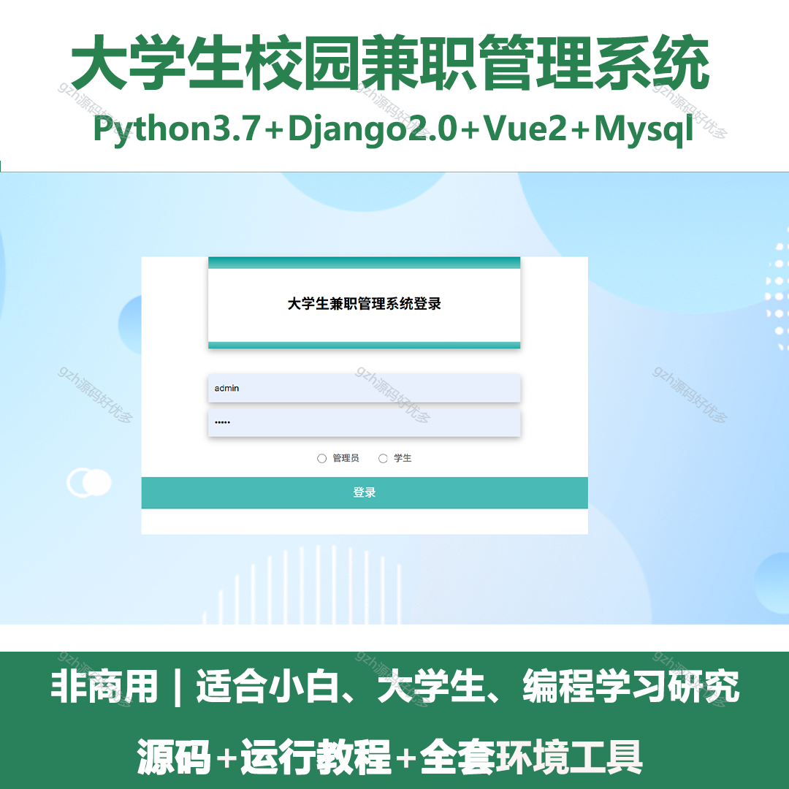
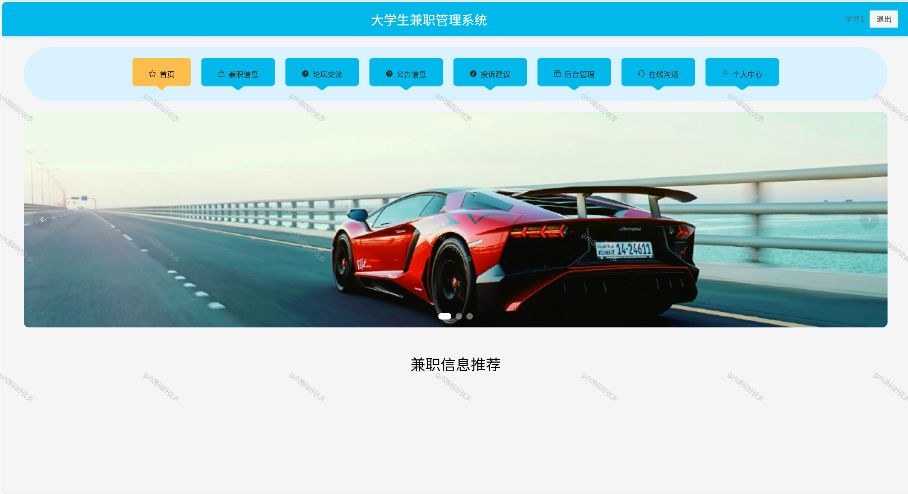
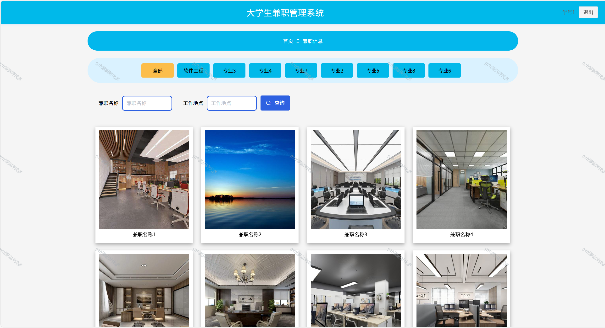
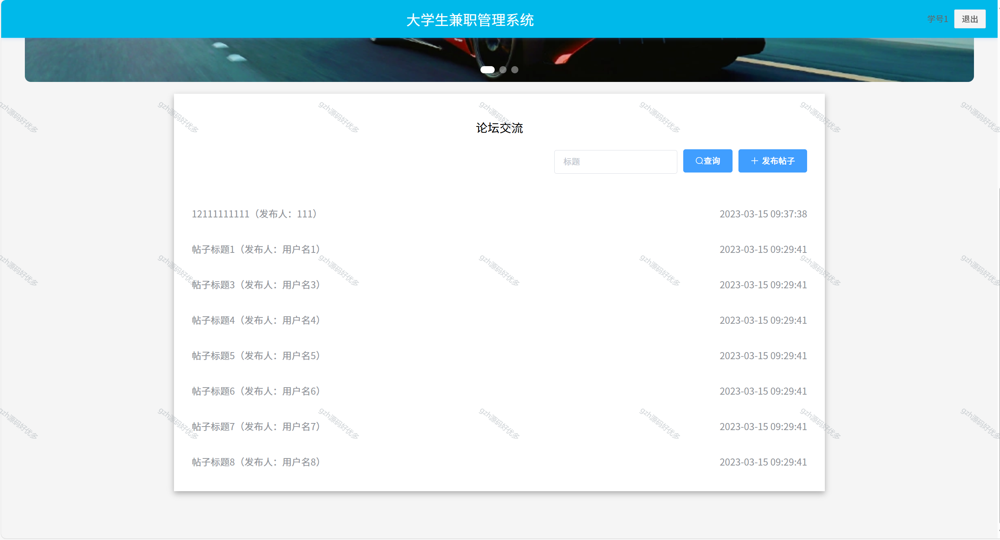
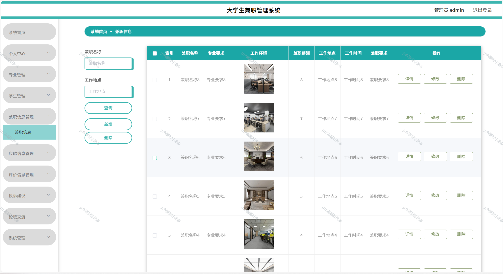
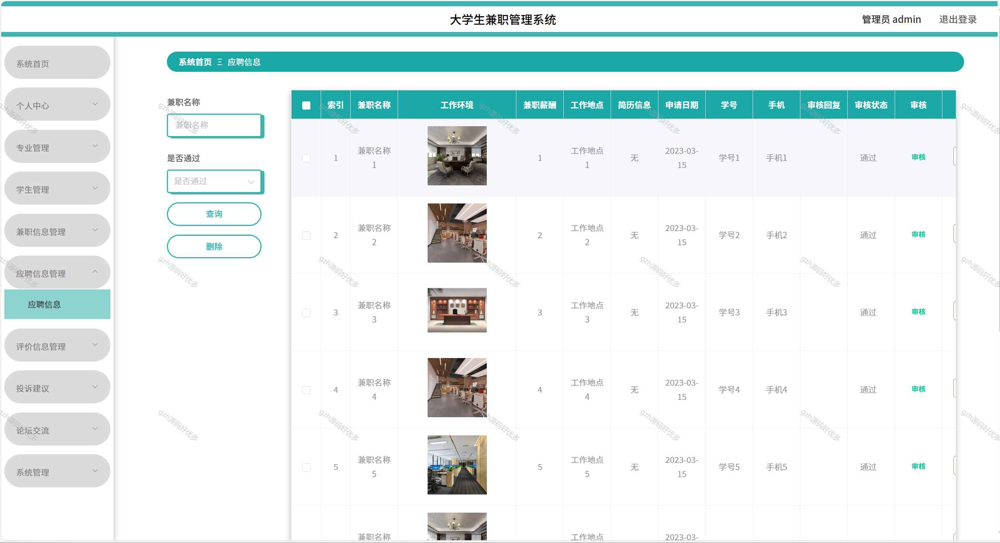
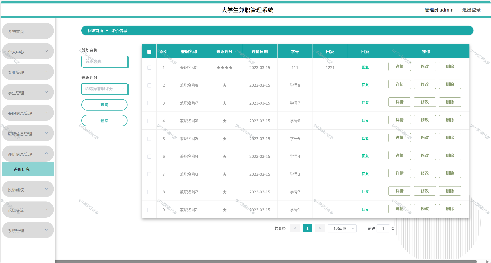
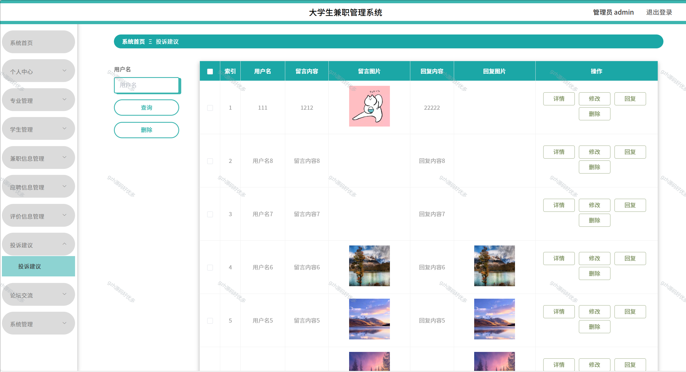

# python055
python055基于Python+Django的大学生校园兼职管理系统
 
## 查看主页获取源码

### 一、关键词
大学生兼职信息管理系统,大学生兼职管理平台,高校学生兼职管理系统

### 二、作品包含
源码+数据库+全套环境和工具资源+本地部署教程

### 三、项目技术
前端技术：Vue2.0、Element-ui
后端技术：Python3.7、Django2.0

### 四、运行环境（以下版本亲测，其他版本未知，请自测）
开发工具：PyCharm + VSCODE

数据库：MySQL5.7（最低要5.7版本）

数据库管理工具：Navicat10+

Python：Python3.7

前端Nodejs：14

浏览器：谷歌浏览器

### 五、项目介绍
项目编号：python055

大学生兼职管理系统可实现对大学生兼职信息的发布、检索、申请、审核及兼职过程跟踪等全流程规范化管理，助力学生安全高效找兼职、企业便捷招兼职、学校有效监管。
大学生兼职管理系统具备兼职信息发布、查询、申请，论坛交流，公告查看，投诉建议反馈，以及管理员对兼职、应聘、评价等信息进行管理的功能 。

### 六、运行截图

